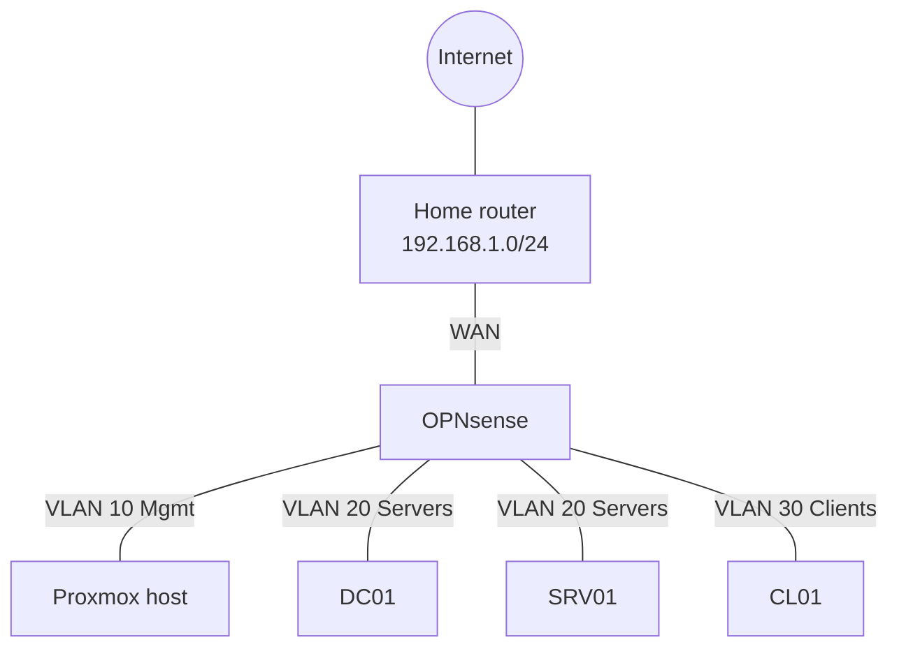

# SI Portfolio Lab

A small company network defined entirely as code — a Proxmox hypervisor, Windows
Server 2025 and Windows 11 images, a routed multi-VLAN network and an Active Directory
domain — written so it can be built and torn down from this repository alone.

It exists to demonstrate Systemintegration skills: hypervisor administration,
infrastructure as code, Windows Server and Active Directory administration, and network
and firewall configuration. Every layer is written out in full and checked on every
push. None of it has been applied to hardware — see [Execution
status](#execution-status) for exactly what is and is not proven.

## Architecture

Full diagram with addressing: [docs/network-diagram.md](docs/network-diagram.md).

## Where to start reading

1. [PLAN.md](PLAN.md) — the goal, the stack, and why each major choice was made.
2. [docs/network-design.md](docs/network-design.md) and
   [docs/network-diagram.md](docs/network-diagram.md) — the network.
3. [docs/ad-design.md](docs/ad-design.md) — the domain: OUs, groups, GPOs.
4. [docs/hardware.md](docs/hardware.md) — the physical host this runs on.
5. [docs/runbook.md](docs/runbook.md) — bare metal to a working domain, in order;
   this is the build log as each milestone lands.
6. [TASKS.md](TASKS.md) — current progress, milestone by milestone.

## Layer index

| Layer | What it does |
| --- | --- |
| [packer/](packer/) | Builds the two base images — Windows Server 2025 and Windows 11 |
| [terraform/](terraform/) | Creates all four VMs on Proxmox: the three Windows guests cloned from those images, plus the OPNsense firewall booted from its installer ISO |
| [powershell/](powershell/) | First-boot config: identity, AD promotion, domain join, GPOs, and a read-only health check |
| [opnsense/](opnsense/) | VLAN interfaces, DHCP, firewall rules and NAT for the lab |

## Execution status

**This lab has not been applied to real hardware.** No Proxmox host exists yet, and
the development machine can't stand in for one — see the execution-status decision
in [PLAN.md](PLAN.md). Every claim below is about what's checked, not what's run.

What the green badge above actually means, on every push:

| Layer | Checked by CI |
| --- | --- |
| `terraform/`, `opnsense/` | `terraform fmt -check` and `terraform validate` |
| `packer/` | `packer fmt -check` and `packer validate` |
| `powershell/` | PSScriptAnalyzer, failing on Error and Warning |
| whole repo | gitleaks secret scan, markdown link check |

This catches malformed code, bad references and leaked secrets — it does not prove
a VM boots, a domain forms, or a firewall rule actually blocks anything. That proof
is Milestone 8: an optional run on rented bare metal, captured as evidence. See
[TASKS.md](TASKS.md) for what's done and what's next; this section's wording
updates the moment a real proof run lands.
