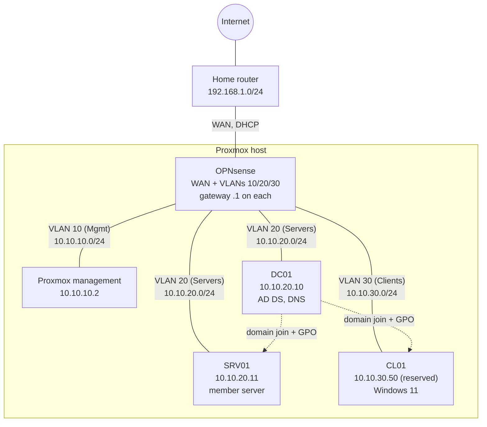

# Network diagram

Addresses and VLAN IDs match `docs/network-design.md` — this is the picture of that
table, not a second source of truth.

```mermaid
flowchart TB
    internet(("Internet"))
    home["Home router<br/>192.168.1.0/24"]
    internet --- home

    subgraph host["Proxmox host"]
        pve["Proxmox management<br/>10.10.10.2"]
        opn["OPNsense<br/>WAN + VLANs 10/20/30<br/>gateway .1 on each"]
        dc01["DC01<br/>10.10.20.10<br/>AD DS, DNS"]
        srv01["SRV01<br/>10.10.20.11<br/>member server"]
        cl01["CL01<br/>10.10.30.50 (reserved)<br/>Windows 11"]
    end

    home -- "WAN, DHCP" --- opn

    opn -- "VLAN 10 (Mgmt)<br/>10.10.10.0/24" --- pve
    opn -- "VLAN 20 (Servers)<br/>10.10.20.0/24" --- dc01
    opn -- "VLAN 20 (Servers)<br/>10.10.20.0/24" --- srv01
    opn -- "VLAN 30 (Clients)<br/>10.10.30.0/24" --- cl01

    dc01 -. "domain join + GPO" .-> srv01
    dc01 -. "domain join + GPO" .-> cl01
```
